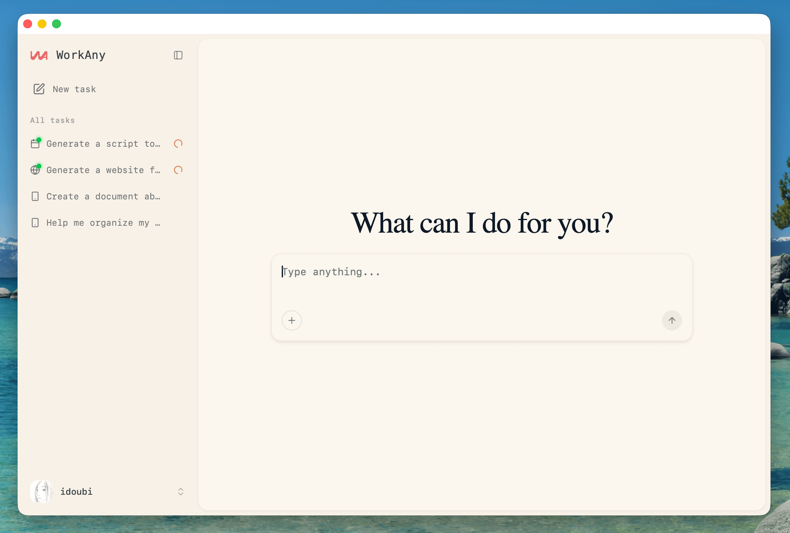
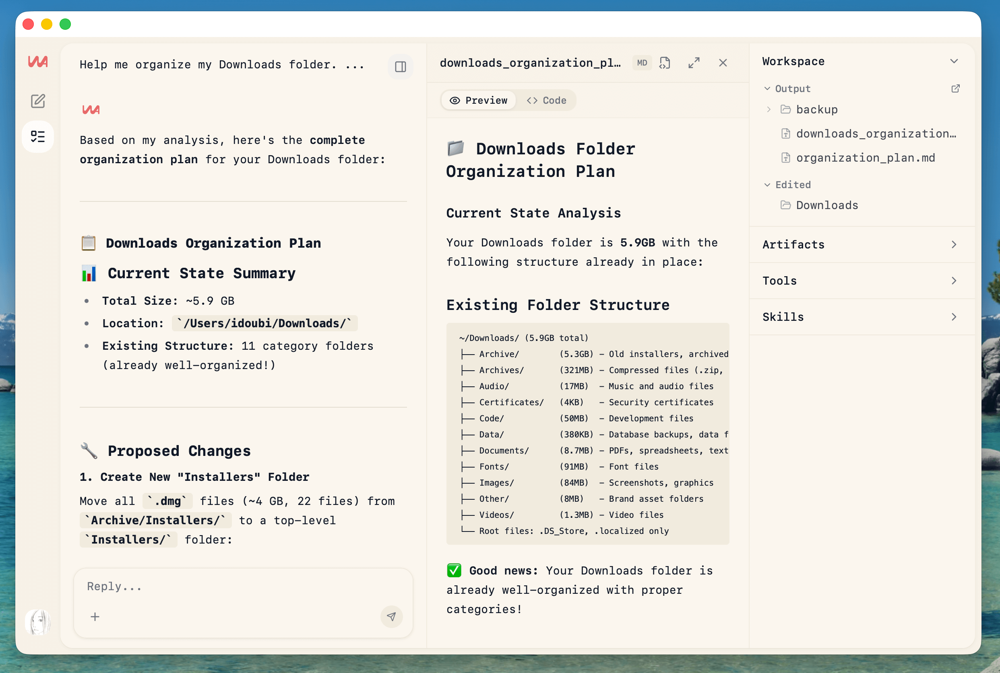
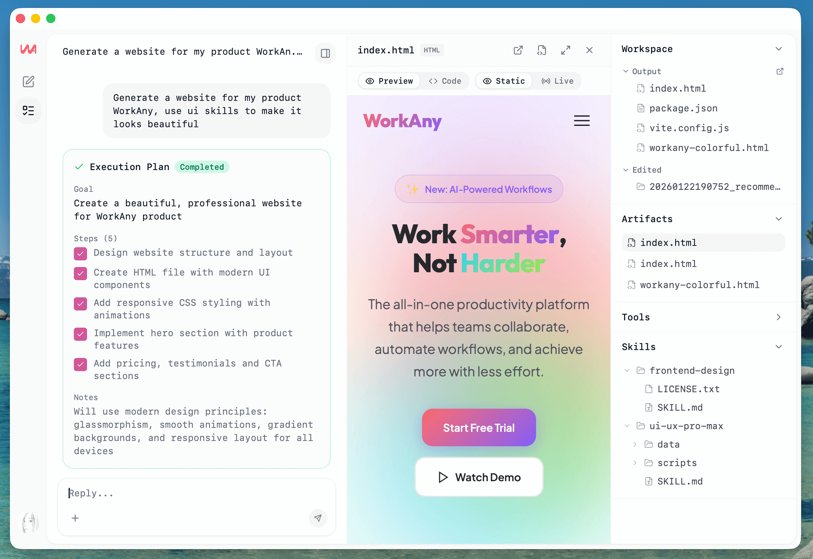
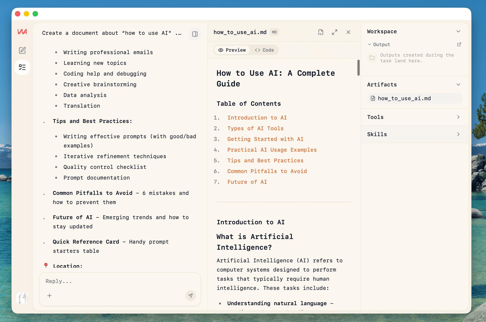
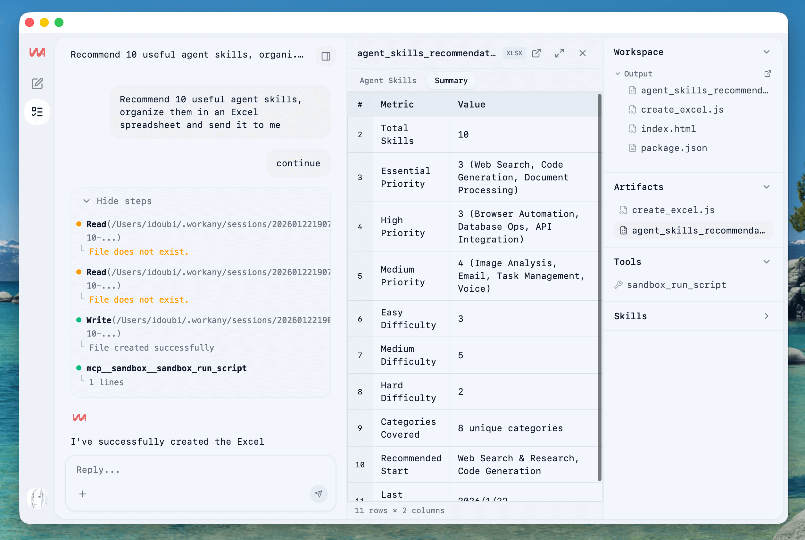
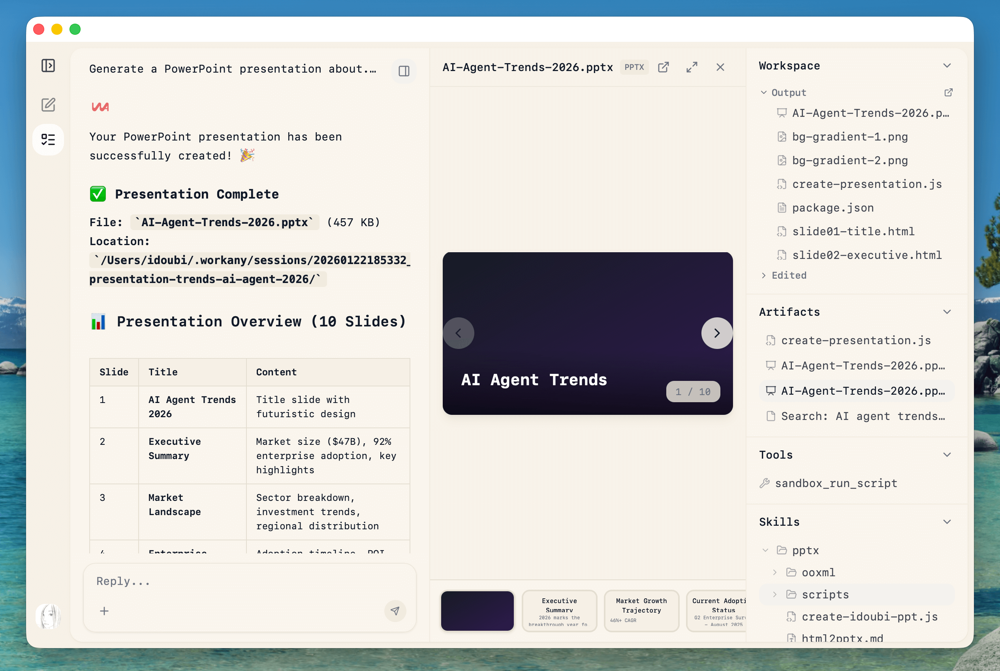
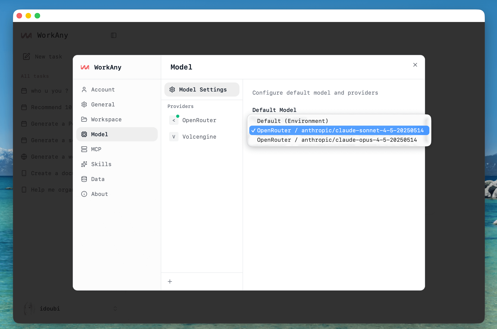

# ForgePilot

ForgePilot is a desktop AI agent application that executes tasks through natural language. It provides real-time code generation, tool execution, and workspace management.

**Website:** [forgepilot.ai](https://forgepilot.ai)



## Previews

- Organize files



- Generate website



- Generate document



- Generate data table



- Generate slides



- Use custom model provider for Agent.



## ❤️ Sponsor

<a href='https://302.ai/?utm_source=forgepilot_github' target='_blank'>
  
</a>

[302.AI](https://302.ai/?utm_source=forgepilot_github) is a pay-as-you-go AI application platform that offers the most comprehensive AI APIs and online applications available.

> If you want to sponsor this project, please contact us via email: [hello@forgepilot.ai](mailto:hello@forgepilot.ai)

## Features

- **Task Execution** - Natural language task input with real-time streaming
- **Agent Runtime** - Powered by `@duangcode/open-agent-sdk`, runs entirely in-process with no external CLI dependency
- **30+ Built-in Tools** - File I/O, shell execution, web search, code editing, and more
- **Sandbox** - Isolated code execution environment
- **Artifact Preview** - Live preview for HTML/React/code files
- **MCP Support** - Model Context Protocol server integration (stdio/SSE/HTTP)
- **Skills Support** - Custom agent skills for extended capabilities
- **Multi-provider** - OpenRouter, Anthropic, OpenAI, and any compatible API endpoint

## Project Structure

```
forgepilot/
├── src/                # Frontend (React + TypeScript)
├── src-api/            # Backend API (Hono + @duangcode/open-agent-sdk)
└── src-tauri/          # Desktop app (Tauri + Rust)
```

## Tech Stack

| Layer | Technologies |
|-------|--------------|
| Frontend | React 19, TypeScript, Vite, Tailwind CSS 4 |
| Backend | Hono, @duangcode/open-agent-sdk, MCP SDK |
| Desktop | Tauri 2, SQLite |


## Architecture


## Development

### Requirements

- Node.js >= 20
- pnpm >= 9
- Rust >= 1.70

### Quick Start

```bash
# Install dependencies
pnpm install

# Start API server
pnpm dev:api

# Start Web and Desktop App (recommended)
pnpm dev:app

# Start Web only (Optional)
pnpm dev:web
```

## Contributing

Contributions are welcome! Please see [CONTRIBUTING.md](CONTRIBUTING.md) for guidelines.

## Community

- [Join Discord](https://discord.gg/rDSmZ8HS39)
- [Follow on X](https://x.com/forgepilotai)

## ❤️ Contributors

<a href="https://github.com/forgepilot-ai/forgepilot/graphs/contributors">
  
</a>

## ⭐️ Star History

[](https://star-history.com/#forgepilot-ai/forgepilot&Timeline)

## License

This project is licensed under the [ForgePilot Community License](LICENSE), based on Apache License 2.0 with additional conditions.

© 2026 ThinkAny, LLC. All rights reserved.
