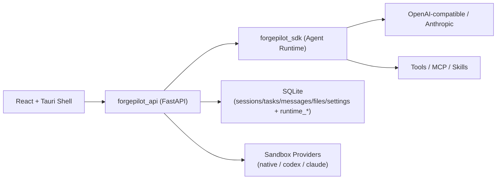

# ForgePilot Agent

<div align="center">
  

  <h3>Python-first Agent Runtime + API Service Layer</h3>
  <p><strong>中文为主 · English as support</strong></p>

  <p>
    <a href="https://github.com/Duang777/forgepilot-agent/actions/workflows/forgepilot-ci.yml"></a>
    <a href="https://www.python.org/"></a>
    <a href="https://fastapi.tiangolo.com/"></a>
    <a href="./LICENSE"></a>
    <a href="https://github.com/Duang777/forgepilot-agent/stargazers"></a>
  </p>
</div>

---

<a id="zh-overview"></a>
## 项目概览（Overview）
> EN: A production-oriented Python rewrite for agent runtime and protocol-compatible API orchestration.

`ForgePilot Agent` 是一个以 Python 为核心的智能体运行时与服务层工程，目标是把“能跑”做成“能长期维护”：

- 协议对齐：SSE、API 路由、工具语义尽量兼容既有前端集成
- 工程化：分层架构、测试矩阵、CI、发布链路、质量门禁
- 生产收口：鉴权、限流、审计、`/files` 细粒度 ACL 与 feature flag

---

<a id="toc"></a>
## 导航（Table of Contents）

### 中文导航
- [项目概览](#zh-overview)
- [核心亮点](#zh-highlights)
- [Quick Demo GIF](#zh-quick-demo)
- [架构图](#zh-architecture)
- [快速开始](#zh-quickstart)
- [API 与协议兼容](#zh-api)
- [安全与生产收口](#zh-security)
- [配置说明](#zh-config)
- [Versioning / Changelog](#zh-versioning)
- [Security Policy](#zh-security-policy)
- [FAQ](#zh-faq)
- [路线图](#zh-roadmap)
- [Star History](#zh-star-history)
- [贡献者](#zh-contributors)
- [贡献指南](#zh-contributing)
- [许可证](#zh-license)

### English Navigation
- [Overview](#zh-overview)
- [Highlights](#zh-highlights)
- [Quick Demo GIF](#zh-quick-demo)
- [Architecture](#zh-architecture)
- [Quick Start](#zh-quickstart)
- [API Compatibility](#zh-api)
- [Security Hardening](#zh-security)
- [Configuration](#zh-config)
- [Versioning / Changelog](#zh-versioning)
- [Security Policy](#zh-security-policy)
- [FAQ](#zh-faq)
- [Roadmap](#zh-roadmap)
- [Star History](#zh-star-history)
- [Contributors](#zh-contributors)
- [Contributing](#zh-contributing)
- [License](#zh-license)

---

<a id="zh-highlights"></a>
## 核心亮点（Highlights）
> EN: Plan/execute flow, full SSE contract, MCP/skills, persistence, and desktop integration.

- 计划/执行双阶段：`/agent/plan -> /agent/execute`
- SSE 事件契约：`text/tool_use/tool_result/result/error/session/done/plan/direct_answer`
- 多 Provider：OpenAI-compatible + Anthropic
- MCP / Skills：本地加载、配置读取、技能导入链路
- 持久化：`sessions/tasks/messages/files/settings` + `runtime_*` 协调表
- 工具覆盖：File/Shell/Web/LSP/Todo/Task/Team 等

---

<a id="zh-quick-demo"></a>
## Quick Demo GIF
> EN: Self-generated demo animation, no third-party UI screenshot assets.


---

<a id="zh-architecture"></a>
## 架构图（Architecture）
> EN: Decoupled runtime and service layers, with stable API contracts for UI.



---

<a id="zh-quickstart"></a>
## 快速开始（Quick Start）
> EN: Start API locally in minutes.

### 1. 安装依赖

```bash
python -m venv .venv
. .venv/Scripts/activate
pip install -e ".[dev]"
```

### 2. 启动 API

```bash
uvicorn forgepilot_api.app:app --host 127.0.0.1 --port 2026 --reload
```

### 3. 使用统一脚本（推荐）

```powershell
# API only
.\scripts\dev.ps1 -Task api -Port 2026

# API + Tauri Desktop
.\scripts\dev.ps1 -Task desktop

# Quality gate
.\scripts\dev.ps1 -Task verify
```

### 4. 健康检查

- `http://127.0.0.1:2026/health`
- `http://127.0.0.1:2026/metrics`（当 `FORGEPILOT_EXPOSE_METRICS=true`）

---

<a id="zh-api"></a>
## API 与协议兼容（API & Protocol Compatibility）
> EN: Stable route naming and SSE payload schema for frontend compatibility.

### 核心路由

- `/agent/*`
- `/sandbox/*`
- `/providers/*`
- `/files/*`
- `/mcp/*`
- `/preview/*`
- `/health`
- `/audit/logs`
- `/metrics`

### SSE 格式

- 传输格式：`data: <json>\n\n`
- 事件类型：`text`, `tool_use`, `tool_result`, `result`, `error`, `session`, `done`, `plan`, `direct_answer`

---

<a id="zh-security"></a>
## 安全与生产收口（Security Hardening）
> EN: Built-in auth, rate limiting, audit logs, and endpoint-level ACL.

### 已实现

- API Key 鉴权（支持 `subject:key`）
- 请求限流（memory / redis）
- 变更型接口审计日志
- `/files` 生产治理：
  - `dev/prod` 模式
  - 高风险端点开关（open / import-skill）
  - subject + scope 细粒度 ACL

### Files ACL Scopes

- 组权限：`files.read` / `files.open` / `files.import`
- 端点权限：
  - `files.readdir`, `files.stat`, `files.read`, `files.skills_dir`, `files.read_binary`, `files.detect_editor`, `files.task`
  - `files.open`, `files.open_in_editor`
  - `files.import_skill`, `files.import_skill_self_check`

---

<a id="zh-config"></a>
## 配置说明（Configuration）
> EN: Environment-first setup with safe defaults.

### 通用
- `FORGEPILOT_LOG_LEVEL`
- `FORGEPILOT_REQUEST_ID_HEADER`
- `FORGEPILOT_EXPOSE_METRICS`

### 鉴权与限流
- `FORGEPILOT_AUTH_MODE` = `off | api_key`
- `FORGEPILOT_API_KEYS`
- `FORGEPILOT_API_KEY_HEADER`
- `FORGEPILOT_AUTH_EXEMPT_PATHS`
- `FORGEPILOT_RATE_LIMIT_ENABLED`
- `FORGEPILOT_RATE_LIMIT_REQUESTS`
- `FORGEPILOT_RATE_LIMIT_WINDOW_SECONDS`
- `FORGEPILOT_RATE_LIMIT_BACKEND` = `memory | redis`
- `FORGEPILOT_RATE_LIMIT_REDIS_URL`

### 运行时状态协调
- `FORGEPILOT_RUNTIME_PLAN_TTL_SECONDS`
- `FORGEPILOT_RUNTIME_PERMISSION_TTL_SECONDS`
- `FORGEPILOT_PERMISSION_DECISION_TIMEOUT_SECONDS`
- `FORGEPILOT_PERMISSION_POLL_INTERVAL_SECONDS`

---

<a id="zh-versioning"></a>
## Versioning / Changelog
> EN: Semantic Versioning with Keep a Changelog style records.

- 版本规范：`SemVer`（`MAJOR.MINOR.PATCH`）
- 变更记录：见 [CHANGELOG.md](./CHANGELOG.md)
- 发布建议：
  - `MAJOR`：不兼容 API/协议变更
  - `MINOR`：向后兼容功能新增
  - `PATCH`：Bugfix / 文档 / 非行为变更

---

<a id="zh-security-policy"></a>
## Security Policy
> EN: Responsible disclosure process and support matrix are documented.

- 安全策略文档：见 [SECURITY.md](./SECURITY.md)
- 漏洞提交流程：请勿公开 issue 直接披露可利用细节
- 推荐部署基线：启用鉴权 + 限流 + 审计 + `FORGEPILOT_FILES_MODE=prod`

---

<a id="zh-faq"></a>
## FAQ

<details>
<summary><strong>Q1: 现在能直接跑通主流程吗？ / Can I run the main flow now?</strong></summary>

可以。当前支持从 `plan` 到 `execute` 到 SSE 回流的完整主链路，并有集成测试覆盖。

</details>

<details>
<summary><strong>Q2: 这是 100% 完全复刻吗？ / Is this 100% parity already?</strong></summary>

核心协议和主流程已可用，长尾行为仍在持续对齐中。

</details>

<details>
<summary><strong>Q3: 如何公网部署更安全？ / How to deploy safely to public network?</strong></summary>

至少开启 API Key、限流、审计日志，并将 `FORGEPILOT_FILES_MODE=prod`。

</details>

---

<a id="zh-roadmap"></a>
## 路线图（Roadmap）

- [ ] 长尾行为 100% 对齐与契约回归自动化
- [ ] 运行时状态扩展到 Redis/Postgres 的多实例方案
- [ ] 更完整 RBAC / 审计检索 / 安全模板
- [ ] 桌面发布签名与制品发布链路完善

---

<a id="zh-star-history"></a>
## Star History

[](https://star-history.com/#Duang777/forgepilot-agent&Date)

---

<a id="zh-contributors"></a>
## 贡献者（Contributors）

<a href="https://github.com/Duang777/forgepilot-agent/graphs/contributors">
  
</a>

---

<a id="zh-contributing"></a>
## 贡献指南（Contributing）
> EN: PRs are welcome. Please keep protocol compatibility and test quality.

- 请先阅读 [CONTRIBUTING.md](./CONTRIBUTING.md)
- 提交前建议执行：`.\scripts\verify_local.ps1`
- 建议 PR 描述包含：变更说明、测试结果、兼容性影响

---

<a id="zh-license"></a>
## 许可证（License）

本项目采用 [MIT License](./LICENSE)。

如计划二次分发或商业发布，请先完成上游许可证条款复核。
