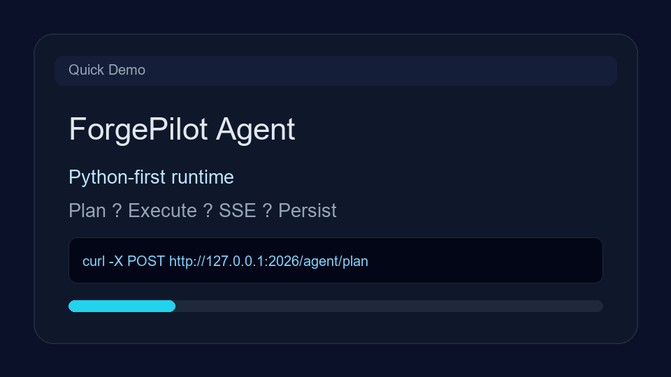
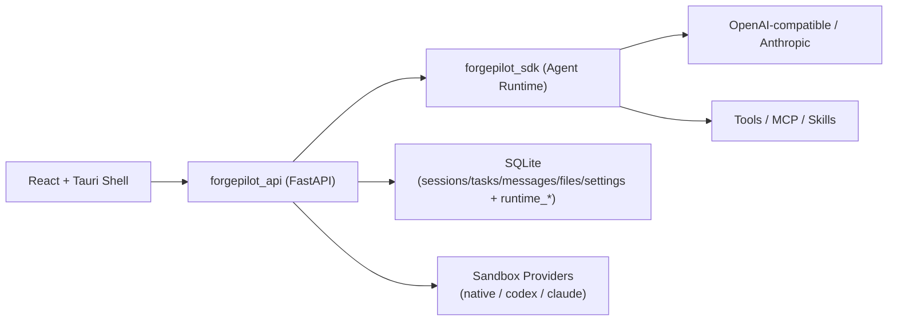

# ForgePilot Agent

<div align="center">
  
  <h3>面向生产的 Python 智能体运行时与 API 服务层</h3>
  <p><sub>Production-ready Agent Runtime & API Service Layer</sub></p>

  <p>
    <a href="https://github.com/Duang777/forgepilot-agent/actions/workflows/forgepilot-ci.yml"></a>
    <a href="https://www.python.org/"></a>
    <a href="https://fastapi.tiangolo.com/"></a>
    <a href="./LICENSE"></a>
    <a href="https://github.com/Duang777/forgepilot-agent/stargazers"></a>
  </p>
</div>

---

<a id="overview"></a>
## 项目概览

`ForgePilot Agent` 聚焦于本地优先与工程化交付，提供完整的智能体执行后端能力：

- 计划/执行双阶段工作流
- SSE 流式事件协议
- 多 Provider 支持（OpenAI-compatible / Anthropic）
- MCP / Skills / Tooling 编排
- 会话与运行时状态持久化
- 安全治理（鉴权、限流、审计、`/files` ACL）

---

<a id="navigation"></a>
## 快速导航

| 模块 | 直达 |
|---|---|
| 开始使用 | [快速开始](#quickstart) · [Quick Demo GIF](#quick-demo) |
| 协议与接口 | [API 与协议兼容](#api-compatibility) · [Parity Report](#parity-report) · [配置说明](#configuration) |
| 安全与规范 | [安全与生产收口](#security) · [Security Policy](#security-policy) |
| 发布与版本 | [Versioning / Changelog](#versioning) · [路线图](#roadmap) |
| 社区协作 | [贡献指南](#contributing) · [贡献者](#contributors) · [Star History](#star-history) |

---

<a id="highlights"></a>
## 核心亮点

- 计划/执行：`/agent/plan -> /agent/execute`
- SSE 事件：`text/tool_use/tool_result/result/error/session/done/plan/direct_answer`
- 存储模型：`sessions/tasks/messages/files/settings` + `runtime_*`
- 工具覆盖：File/Shell/Web/LSP/Todo/Task/Team
- 端侧联调：React + Tauri + Python sidecar

---

<a id="quick-demo"></a>
## Quick Demo GIF



---

<a id="architecture"></a>
## 架构图



---

<a id="quickstart"></a>
## 快速开始

### 1. 安装依赖

```bash
python -m venv .venv
. .venv/Scripts/activate
pip install -e ".[dev]"
```

### 2. 启动 API

```bash
uvicorn forgepilot_api.app:app --host 127.0.0.1 --port 2026 --reload
```

### 3. 使用统一脚本（推荐）

```powershell
# API only
.\scripts\dev.ps1 -Task api -Port 2026

# API + Tauri Desktop
.\scripts\dev.ps1 -Task desktop

# Quality gate
.\scripts\dev.ps1 -Task verify
```

### 4. 健康检查

- `http://127.0.0.1:2026/health`
- `http://127.0.0.1:2026/metrics`（当 `FORGEPILOT_EXPOSE_METRICS=true`）

---

<a id="api-compatibility"></a>
## API 与协议兼容

### 核心路由

- `/agent/*`
- `/sandbox/*`
- `/providers/*`
- `/files/*`
- `/mcp/*`
- `/preview/*`
- `/health`
- `/audit/logs`
- `/metrics`

### SSE 传输

- 格式：`data: <json>\n\n`
- 事件：`text`, `tool_use`, `tool_result`, `result`, `error`, `session`, `done`, `plan`, `direct_answer`

---

<a id="parity-report"></a>
## Parity Report

- 最新自动报告：[`docs/parity_report.md`](./docs/parity_report.md)
- 生成命令：

```bash
python scripts/generate_parity_report.py --repo-root . --output docs/parity_report.md
```

- 严格校验（缺任何基线项即失败）：

```bash
python scripts/generate_parity_report.py --repo-root . --output docs/parity_report.md --strict
```

---

<a id="security"></a>
## 安全与生产收口

### 已实现能力

- API Key 鉴权（支持 `subject:key`）
- JWT 鉴权（`HS256/384/512`）与 API Key/JWT 混合模式
- 路由级 RBAC（可配置策略 + subject scope）
- 请求限流（memory / redis）
- 变更型接口审计日志
- OpenTelemetry 追踪（HTTP/SSE/tool 关键链路）
- `/files` 端点治理：
  - `dev/prod` 模式
  - 高风险端点开关（open / import-skill）
  - subject + scope 细粒度 ACL

### Files ACL Scope

- 组权限：`files.read` / `files.open` / `files.import`
- 端点权限：
  - `files.readdir`, `files.stat`, `files.read`, `files.skills_dir`, `files.read_binary`, `files.detect_editor`, `files.task`
  - `files.open`, `files.open_in_editor`
  - `files.import_skill`, `files.import_skill_self_check`

生产配置示例：

```bash
FORGEPILOT_FILES_MODE=prod
FORGEPILOT_FILES_DANGEROUS_ENABLED=true
FORGEPILOT_FILES_ACL_DEFAULT=files.read
FORGEPILOT_FILES_ACL_SUBJECTS=admin=*;operator=files.read,files.open,files.import;viewer=files.read
```

---

<a id="configuration"></a>
## 配置说明

### 通用
- `FORGEPILOT_LOG_LEVEL`
- `FORGEPILOT_REQUEST_ID_HEADER`
- `FORGEPILOT_EXPOSE_METRICS`
- `NODE_ENV`（`production` 下默认 CORS 自动收紧到 localhost / tauri 域）

### 鉴权与限流
- `FORGEPILOT_AUTH_MODE` = `off | api_key | jwt | api_key_or_jwt`
- `FORGEPILOT_API_KEYS`
- `FORGEPILOT_API_KEY_HEADER`
- `FORGEPILOT_JWT_HEADER`
- `FORGEPILOT_JWT_BEARER_PREFIX`
- `FORGEPILOT_JWT_SECRET`
- `FORGEPILOT_JWT_ALGORITHMS`
- `FORGEPILOT_JWT_ISSUER`
- `FORGEPILOT_JWT_AUDIENCE`
- `FORGEPILOT_JWT_SUBJECT_CLAIM`
- `FORGEPILOT_JWT_SCOPE_CLAIM`
- `FORGEPILOT_JWT_ROLES_CLAIM`
- `FORGEPILOT_AUTH_SUBJECT_SCOPES`
- `FORGEPILOT_AUTH_EXEMPT_PATHS`
- `FORGEPILOT_RBAC_ENABLED`
- `FORGEPILOT_RBAC_DEFAULT_ALLOW`
- `FORGEPILOT_RBAC_POLICIES`
- `FORGEPILOT_RBAC_SUBJECT_SCOPES`
- `FORGEPILOT_RATE_LIMIT_ENABLED`
- `FORGEPILOT_RATE_LIMIT_REQUESTS`
- `FORGEPILOT_RATE_LIMIT_WINDOW_SECONDS`
- `FORGEPILOT_RATE_LIMIT_BACKEND` = `memory | redis`
- `FORGEPILOT_RATE_LIMIT_REDIS_URL`

### 运行时协调
- `FORGEPILOT_RUNTIME_PLAN_TTL_SECONDS`
- `FORGEPILOT_RUNTIME_PERMISSION_TTL_SECONDS`
- `FORGEPILOT_PERMISSION_DECISION_TIMEOUT_SECONDS`
- `FORGEPILOT_PERMISSION_POLL_INTERVAL_SECONDS`
- `FORGEPILOT_RUNTIME_STATE_BACKEND` = `sqlite | redis`
- `FORGEPILOT_RUNTIME_STATE_REDIS_URL`
- `FORGEPILOT_RUNTIME_STATE_REDIS_KEY_PREFIX`
- `FORGEPILOT_RUNTIME_STATE_FAIL_OPEN`
- `FORGEPILOT_SESSION_STRICT_PARITY` = `true | false`
  - 默认 `true`（`1`），对齐 upstream `open-agent-sdk-typescript/src/session.ts` 语义。
  - 关闭后启用 Python 扩展行为（结构修复回写、缺失会话 append 自动创建等）。
- Redis 后端下 permission 响应走 pub/sub 事件优先（轮询兜底）

### 可观测性
- `FORGEPILOT_OTEL_ENABLED`
- `FORGEPILOT_OTEL_EXPORTER` = `console | otlp`
- `FORGEPILOT_OTEL_OTLP_ENDPOINT`
- Prometheus 指标新增：
  - SSE 生命周期（started/completed/disconnected）
  - tool use/error 按工具聚合
  - sandbox fallback/provider 分布

配置模板：
- 开发环境：[`./.env.example`](./.env.example)
- 生产环境：[`./.env.production.example`](./.env.production.example)

---

<a id="versioning"></a>
## Versioning / Changelog

- 版本策略：`SemVer`（`MAJOR.MINOR.PATCH`）
- 变更记录：见 [CHANGELOG.md](./CHANGELOG.md)
- 发布流水线：推送 tag（`v*`）自动触发 `.github/workflows/release.yml`
- 发布建议：
  - `MAJOR`：不兼容 API/协议变更
  - `MINOR`：向后兼容功能新增
  - `PATCH`：Bugfix / 文档 / 非行为变更

---

<a id="security-policy"></a>
## Security Policy

- 安全策略文档：见 [SECURITY.md](./SECURITY.md)
- 漏洞提交流程：请勿在公开 issue 直接披露可利用细节
- 推荐部署基线：启用鉴权 + 限流 + 审计 + `FORGEPILOT_FILES_MODE=prod`

---

<a id="faq"></a>
## FAQ

<details>
<summary><strong>Q1: 现在能直接跑通主流程吗？</strong></summary>

可以。当前支持从 `plan` 到 `execute` 到 SSE 回流的完整主链路，并有集成测试覆盖。

</details>

<details>
<summary><strong>Q2: 如何公网部署更安全？</strong></summary>

至少开启 API Key、限流、审计日志，并将 `FORGEPILOT_FILES_MODE=prod`。

</details>

<details>
<summary><strong>Q3: 支持哪些模型接口？</strong></summary>

支持 OpenAI-compatible 与 Anthropic，可在配置中切换 Provider。

</details>

---

<a id="roadmap"></a>
## 路线图

- [ ] 运行时状态进一步扩展到 Postgres（Redis 已支持）
- [ ] 更完整 RBAC / 审计检索 / 安全模板
- [ ] 桌面发布签名与制品发布链路完善
- [ ] 性能基准与容量压测报告固化

---

<a id="star-history"></a>
## Star History

[](https://star-history.com/#Duang777/forgepilot-agent&Date)

---

<a id="contributors"></a>
## 贡献者

<a href="https://github.com/Duang777/forgepilot-agent/graphs/contributors">
  
</a>

---

<a id="contributing"></a>
## 贡献指南

- 请先阅读 [CONTRIBUTING.md](./CONTRIBUTING.md)
- 提交前建议执行：`.\scripts\verify_local.ps1`
- PR 描述建议包含：变更说明、测试结果、兼容性影响

---

<a id="license"></a>
## 许可证

本项目采用 [MIT License](./LICENSE)。

如计划二次分发或商业发布，请先完成上游许可证条款复核。
