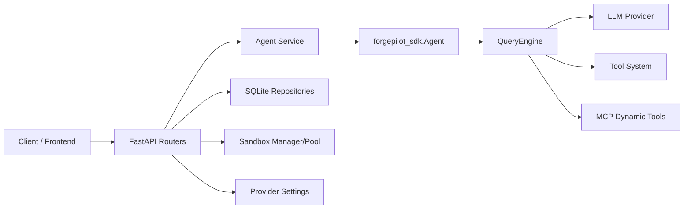
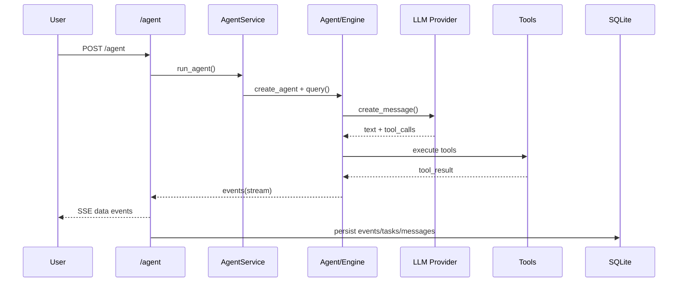

# Agent 后端平台深度解析与面试回答手册

> 适用场景：你要把这个项目作为自己的核心项目，在技术面试中进行系统化讲解。  
> 文档目标：不只讲“做了什么”，而是讲清楚“为什么这么设计、怎么落地、如何保证质量、有哪些取舍”。  
> 更新时间：2026-04-07（基于当前代码仓库状态）

---

## 0. 一句话定位（开场 15 秒）

这是一个 **Agent 后端执行平台**，将大模型问答能力升级为“可执行任务系统”，核心支持：

1. 工具调用（文件/命令/Web/任务/LSP/Skill/MCP）
2. 计划-执行双阶段（Plan -> Execute）
3. 权限审批闭环（permission request/approve/deny）
4. 流式协议输出（SSE）
5. 沙箱执行与 provider 回退
6. 会话与任务全链路持久化（SQLite）

---

## 1. 项目背景与业务价值

### 1.1 要解决的问题

传统“聊天型 AI 后端”有三个痛点：

1. 只能回答，不能可靠执行任务。
2. 执行不可控，容易误操作（写文件、执行命令等）。
3. 缺乏可追踪性，难以审计和复盘。

### 1.2 这个平台的目标

1. 把模型输出放进可控执行循环（Query Loop）。
2. 给执行动作加治理（权限、计划、回退、错误契约）。
3. 对外提供稳定接口（兼容 SSE + 统一 JSON 错误语义）。
4. 对内实现可扩展架构（Provider 插件化、MCP 动态工具注入）。

### 1.3 可量化结果（当前仓库）

1. Python 文件：64 个
2. 代码规模：约 9012 行
3. API 路由：56 个
4. 工具定义：36 个
5. 自动化测试：15 个测试文件，71 个用例，全部通过

---

## 2. 总体架构（分层讲法）

## 2.1 分层结构

1. **接入层（FastAPI）**  
对外暴露 `/agent`、`/sandbox`、`/providers`、`/files`、`/mcp`、`/preview`。

2. **编排层（Service）**  
负责请求生命周期、plan/execute 状态机、错误规范、上下文增强、权限回调。

3. **执行层（forgepilot_sdk）**  
负责模型交互、工具调度、消息循环、MCP 注入、会话读写。

4. **基础设施层**  
Provider 适配、Sandbox 管理与池化、SQLite、配置管理。

## 2.2 架构图



---

## 3. 每个部分深入解析（逐模块）

## 3.1 API 接入层

关键文件：

1. `forgepilot_api/main.py`
2. `forgepilot_api/api/*.py`
3. `forgepilot_api/api/utils.py`

### 3.1.1 职责

1. 提供统一 HTTP 接口
2. 将异步事件流封装为 SSE
3. 参数校验和错误码契约
4. 生命周期管理（启动建库、退出清理）

### 3.1.2 关键实现点

1. `lifespan` 初始化数据库并在退出时关闭 preview/sandbox 资源。
2. SSE 输出统一通过 `sse_event_stream` 包装，保持 `data: <json>\n\n` 格式。
3. 各路由返回结构统一，包括成功、错误、done 事件。

### 3.1.3 面试可讲亮点

1. 接口层不做复杂业务，只做协议标准化与容错边界。
2. 把流式输出当一等公民（而不是后补功能）。

---

## 3.2 Agent 编排层（核心业务）

关键文件：

1. `forgepilot_api/services/agent_service.py`
2. `forgepilot_api/api/agent.py`

### 3.2.1 职责

1. 对接三种模式：chat、plan、execute
2. 组装 AgentOptions（模型、工具、权限、会话、技能、MCP）
3. 管理权限请求生命周期
4. 处理计划解析、fallback、异常标记
5. 映射 SDK 事件到 API 事件

### 3.2.2 核心流程函数

1. `run_planning_phase`：规划阶段，仅做计划输出或直接回答。
2. `run_agent`：执行阶段，完整工具调用链路。
3. `run_execution_phase`：读取 planId，拼接执行指令并运行。

### 3.2.3 高价值机制

1. **鲁棒 JSON 提取**  
模型可能输出代码块、混合文本或半结构化 JSON，服务层会尝试多策略解析（代码块提取、首个 JSON 对象扫描、fallback direct_answer）。

2. **统一错误语义**  
将底层异常映射成可识别错误码，如：
`__MODEL_NOT_CONFIGURED__`、`__API_KEY_ERROR__`、`__CUSTOM_API_ERROR__`。

3. **上下文裁剪**  
历史对话按 token 估算截断，平衡上下文保真与成本。

4. **工作目录约束**  
执行 prompt 前注入 workspace 规则，减少“越界写文件”风险。

### 3.2.4 面试可讲亮点

1. 不是单纯“调用 SDK”，而是做了执行治理层。
2. 把模型不稳定输出转为稳定 API 契约，这是后端工程价值。

---

## 3.3 SDK 执行层（Agent + QueryEngine）

关键文件：

1. `forgepilot_sdk/agent.py`
2. `forgepilot_sdk/engine.py`
3. `forgepilot_sdk/types.py`

### 3.3.1 职责

1. 统一模型调用接口
2. 维护多轮消息状态
3. 根据模型 tool_calls 执行工具并回填结果
4. 输出标准化事件流（assistant/tool_result/result/system）

### 3.3.2 Query Loop 机制

执行循环大致如下：

1. 用户 prompt 入栈
2. 调 Provider 生成内容（文本 + tool_calls）
3. 若有工具调用则执行工具
4. 把 tool_result 作为 tool message 回喂模型
5. 若无工具调用则返回成功结果
6. 到达 max_turns 则输出错误结果

### 3.3.3 权限 gating

1. 根据 `permission_mode` 和 `tool.read_only` 判断是否需要审批。
2. 需要审批时发送 `permission_request` 事件。
3. 等待外部决策 Future。
4. deny 时返回工具错误，不执行副作用。

### 3.3.4 面试可讲亮点

1. 执行引擎做了并发优化：全只读工具可并发执行。
2. 把“语言模型 + 工具系统”做成可重复运行的状态机。

---

## 3.4 Tool 系统

关键文件：

1. `forgepilot_sdk/tools/core.py`
2. `forgepilot_sdk/tools/registry.py`
3. `forgepilot_sdk/tools/base.py`

### 3.4.1 能力组成

平台提供 36 个基础工具，覆盖：

1. 文件：Read/Write/Edit/Glob/Grep/NotebookEdit
2. Shell：Bash
3. Web：WebSearch/WebFetch
4. Agent 协作：Agent/SendMessage/TeamCreate/TeamDelete
5. Task：TaskCreate/TaskList/TaskUpdate/TaskGet/TaskStop/TaskOutput/Task(legacy)
6. 工作流：EnterWorktree/ExitWorktree/EnterPlanMode/ExitPlanMode/AskUserQuestion/ToolSearch
7. MCP 资源：ListMcpResources/ReadMcpResource
8. 配置与调度：CronCreate/CronDelete/CronList/RemoteTrigger/Config/TodoWrite
9. 代码智能：LSP/Skill

### 3.4.2 设计思路

1. 工具统一实现 `ToolDefinition`，包含输入 schema 与执行函数。
2. 工具池支持 `allowed_tools` / `disallowed_tools` 动态裁剪。
3. 工具执行结果统一返回 `ToolResult(content, is_error)`。

### 3.4.3 面试可讲亮点

1. 工具系统是“可控执行面”，不是普通 util 函数集合。
2. schema 驱动 + 工具注册让扩展成本稳定。

---

## 3.5 Provider 适配层（模型解耦）

关键文件：

1. `forgepilot_sdk/providers/base.py`
2. `forgepilot_sdk/providers/anthropic_messages.py`
3. `forgepilot_sdk/providers/openai_compatible.py`

### 3.5.1 设计目标

1. 上层只依赖统一 `create_message(...)` 协议
2. 下层适配不同模型协议差异（消息格式、工具调用格式、usage 字段）

### 3.5.2 关键细节

1. Anthropic：使用 Messages API 格式，tool_use/tool_result block 映射。
2. OpenAI-compatible：function tool_calls 映射，并支持 streaming fallback 聚合内容。
3. usage 字段归一化到 `input_tokens/output_tokens`。

### 3.5.3 面试可讲亮点

1. Provider 层屏蔽协议差异，保证业务层稳定。
2. 兼容异常网关的 fallback 处理体现“生产经验”。

---

## 3.6 MCP 扩展层

关键文件：

1. `forgepilot_sdk/mcp/client.py`
2. `forgepilot_api/api/mcp.py`

### 3.6.1 核心能力

1. 支持 stdio/http/sse 三种 MCP 传输
2. 动态发现工具并注入 tool pool
3. 提供资源列举与读取（resources/list, resources/read）

### 3.6.2 关键设计

1. MCP 工具会被包装成标准 ToolDefinition。
2. 命名规范 `mcp__<server>__<tool>` 避免冲突。
3. 支持连接状态跟踪，失败连接不会阻塞全系统。

### 3.6.3 面试可讲亮点

1. 平台可通过 MCP 快速接入外部系统能力。
2. 工具注入在运行时完成，不需要重启业务逻辑层。

---

## 3.7 Sandbox 执行层

关键文件：

1. `forgepilot_api/api/sandbox.py`
2. `forgepilot_api/sandbox/manager.py`
3. `forgepilot_api/sandbox/pool.py`
4. `forgepilot_api/sandbox/registry.py`

### 3.7.1 目标

1. 隔离执行用户脚本/命令
2. 支持 provider 可用性检测与回退
3. 降低冷启动成本（池化复用）

### 3.7.2 关键机制

1. provider 选择策略：优先指定 provider，不可用则回退。
2. pool lease 机制：获取实例 -> 执行 -> release。
3. 支持 `/sandbox/pool/stats` 可观测性。
4. 针对网络依赖包自动强制 native（`/sandbox/run/file`）。

### 3.7.3 面试可讲亮点

1. 可用性优先：失败回退比“严格绑定 provider”更实用。
2. 池化是运行时优化，不侵入业务 API。

---

## 3.8 持久化层（SQLite）

关键文件：

1. `forgepilot_api/storage/db.py`
2. `forgepilot_api/storage/repositories.py`
3. `forgepilot_sdk/session.py`

### 3.8.1 数据模型

1. `sessions`：会话元信息、task_count
2. `tasks`：任务状态、费用、耗时、索引
3. `messages`：事件流记录（text/tool_use/tool_result/error）
4. `files`：任务产物索引
5. `settings`：provider/agent 默认配置

### 3.8.2 一致性策略

1. task_index 使用事务原子分配（`BEGIN IMMEDIATE`）。
2. 任务事件逐条落库，支持审计和重建上下文。
3. SDK transcript 与 API DB 双路径并存，兼顾协议兼容与运行态存储。

### 3.8.3 面试可讲亮点

1. 强调“可追踪性”，不是只追求执行成功。
2. 通过事务保障并发下序号和计数一致。

---

## 3.9 配置与运行时回退

关键文件：

1. `forgepilot_api/services/provider_service.py`
2. `forgepilot_api/services/codex_config_service.py`
3. `forgepilot_api/api/providers.py`

### 3.9.1 关键能力

1. 支持前端同步 provider/agent 设置。
2. 设置缺失时可从本地 Codex 配置回退加载。
3. 支持连接检测接口 `/providers/detect`。

### 3.9.2 价值

1. 降低“首次配置门槛”。
2. 避免因配置缺失导致平台不可用。

---

## 3.10 Preview 与 Files 子系统

关键文件：

1. `forgepilot_api/api/preview.py`
2. `forgepilot_api/services/preview_service.py`
3. `forgepilot_api/api/files.py`

### 3.10.1 Preview

1. 检测 node/pnpm/npm/yarn 可用性。
2. 自动选择包管理器启动 dev server。
3. 提供 start/stop/status/stop-all。

### 3.10.2 Files

1. 支持 readdir/read/stat/open/read-binary。
2. 路径访问做 home/temp 白名单约束。
3. 保留与前端兼容的接口风格。

---

## 4. 三条关键链路（面试重点）

## 4.1 `/agent` 执行链路



关键点：

1. 事件流是主协议，不是附加功能。
2. 工具结果会反馈到模型形成闭环。
3. 执行过程可中断、可审计。

## 4.2 `/agent/plan` + `/agent/execute` 链路

1. Plan 阶段：禁用工具，产出结构化计划。
2. Execute 阶段：读 planId，拼接执行指令，完整工具执行。
3. Execute 完成后删除 plan 缓存，防止重复消费。

## 4.3 `/sandbox/run/file` 链路

1. 解析 runtime（python/node/bun）。
2. 读取 provider 偏好与可用性。
3. 如果检测到网络依赖包且未显式指定 provider，强制 native。
4. 执行后返回 provider 信息、fallback 原因和执行结果。

---

## 5. 事件契约（SSE）

核心事件类型：

1. `text`
2. `tool_use`
3. `tool_result`
4. `result`
5. `error`
6. `session`
7. `done`
8. `plan`
9. `direct_answer`
10. `permission_request`

设计原则：

1. 事件语义稳定，便于前端渲染状态机。
2. 出错也要输出 `done`，保证流终止可感知。
3. 错误不是“抛异常断流”，而是事件化返回。

---

## 6. 可靠性与边界处理

## 6.1 模型输出不稳定

策略：

1. 多轮 JSON 提取
2. code block 容错
3. 结构化失败时 direct_answer fallback

## 6.2 权限控制

策略：

1. 只读工具直通
2. 非只读工具可触发审批
3. deny 时返回 error tool_result

## 6.3 provider 不可用

策略：

1. 自动回退可用 provider
2. 记录 `usedFallback/fallbackReason`

## 6.4 并发一致性

策略：

1. task_index 原子预留
2. session.task_count 同步更新

---

## 7. 测试体系（怎么证明可用）

测试覆盖类别：

1. 接口契约测试（错误码、字段结构）
2. SSE 事件顺序与字段测试
3. 工具族完整性与 roundtrip 测试
4. 权限闭环测试
5. MCP 传输和资源读写测试
6. Sandbox 池化与压力测试

当前结果：

1. 15 个测试文件
2. 71 个测试用例
3. 全量通过

---

## 8. 关键技术取舍（面试高频）

## 8.1 为什么用 SQLite

1. 单机部署成本低
2. 事务能力足够支持一致性需求
3. 方便 sidecar 场景与本地工具链集成

代价：

1. 水平扩展能力有限
2. 高并发写入上限受限

## 8.2 为什么用 SSE 而不是 WebSocket

1. 你这里的业务是服务端单向流更常见
2. HTTP 语义简单，代理友好
3. 客户端实现成本更低

代价：

1. 双向交互需额外接口补足（如 `/agent/permission`）

## 8.3 为什么要 plan/execute 两阶段

1. 可审阅可控，适合高风险动作
2. 方便插入人工审批
3. 更接近“任务执行”而非“聊天回复”

---

## 9. 未来可演进方向（诚实+有深度）

1. 引入 Redis/Kafka 做异步队列，提高并发吞吐。
2. 将计划、任务、权限状态转移到显式状态机引擎。
3. 增加指标体系（p95 latency、tool failure rate、provider fallback rate）。
4. 增加幂等键，提升请求重试安全性。
5. 增加多租户隔离（workspace quota、权限策略模板）。
6. 对常用工具执行做结果缓存，降低重复成本。
7. 将 settings 与 session 做版本化迁移机制。

---

## 10. 面试回答库（可直接背）

## 10.1 60 秒项目介绍

我做的是一个 Agent 后端执行平台，目标是把“模型聊天”变成“可执行任务系统”。  
架构上分四层：API 接入层、Agent 编排层、SDK 执行层和基础设施层。  
执行上采用 Query Loop，模型每轮可返回 text 和 tool_calls，工具执行结果会回喂模型，直到结束。  
为了控制风险，我做了计划-执行双阶段和权限审批闭环。  
系统支持多模型协议适配、MCP 动态扩展、SSE 流式事件、Sandbox 回退和 SQLite 审计落库。  
目前有 56 个 API 路由，36 个工具定义，71 个自动化测试全部通过。

## 10.2 3 分钟技术深挖

我先讲主链路：`/agent` 请求进入编排层后会统一组装 AgentOptions，包括模型配置、工作目录、权限模式、技能目录和 MCP 服务器。  
然后进入 SDK QueryEngine 循环：先调模型拿 `text + tool_calls`，再执行工具，工具结果以 `tool_result` 回到上下文。  
如果是只读工具会并发执行；如果是非只读工具，先触发 `permission_request`，等待 `/agent/permission` 回填。  
在协议层，我做了 Anthropic 与 OpenAI-compatible 的适配，并处理了部分网关非流式空内容问题，必要时回退到流式聚合。  
在持久化层，事件会按 taskId 落库，包含 text/tool_use/tool_result/error，便于审计和回放。任务索引使用事务原子保留，保证并发下序号一致。  
在运行层，sandbox 支持 provider 可用性检测与回退，并提供池化减少冷启动。  
最终通过契约测试、SSE 顺序测试、工具 parity 测试、池化与权限测试保证行为稳定。

## 10.3 高频问题与回答（20 题）

### Q1：这个项目最核心的技术挑战是什么？

A：模型输出不稳定和执行副作用风险。前者通过结构化解析+fallback 保证可用，后者通过权限审批与 plan/execute 分层降低风险。

### Q2：为什么不直接把模型回复给前端？

A：因为这个系统是“执行系统”不是“聊天系统”。需要工具调度、状态管理、错误治理和可审计记录。

### Q3：如何保证工具调用安全？

A：工具有 read_only 元数据，非只读可触发权限审批；执行前有 workspace 约束；拒绝会返回 error tool_result，不落地副作用。

### Q4：为什么采用 SSE？

A：单向流场景足够、实现简单、代理兼容性好。权限这类反向动作单独用普通 POST 接口完成。

### Q5：怎么处理 provider 差异？

A：在 Provider 适配层统一消息和工具协议，上层只依赖标准 `create_message`，差异下沉到 adapter。

### Q6：如果 provider 宕机怎么办？

A：sandbox 和 provider 选择都有 fallback 策略，返回 `usedFallback/fallbackReason`，保证可用性优先。

### Q7：MCP 的价值是什么？

A：把外部系统能力动态注入到工具空间，减少核心代码改动，实现“平台型扩展”。

### Q8：为什么要双存储（SDK transcript + SQLite）？

A：transcript 保持 SDK 兼容语义，SQLite 负责业务审计与任务查询，两者关注点不同。

### Q9：并发下如何保证 task 索引不冲突？

A：使用 SQLite `BEGIN IMMEDIATE` 事务原子地读取和更新 session.task_count，再分配 task_index。

### Q10：你如何定义“这个项目可上线”？

A：接口契约稳定、错误语义统一、核心链路可观测、自动化测试覆盖关键场景、异常有回退策略。

### Q11：如何处理模型返回脏 JSON？

A：分层提取：先 code block，再查找对象边界，再 fallback 到 direct_answer，避免整个流程失败。

### Q12：为什么需要 plan/execute？

A：把高风险动作拆成“先规划再执行”，可加入人工审核，也提高可解释性和可控性。

### Q13：工具这么多，怎么保持可维护？

A：统一 ToolDefinition schema + 注册机制 + parity 测试，新增工具只需遵循统一接口。

### Q14：如何做灰度或回滚？

A：协议层兼容是前提，provider/config 可切换，必要时可通过 settings 回切默认行为。

### Q15：性能瓶颈可能在哪？

A：模型 API 延迟、外部工具执行耗时、单机 SQLite 并发写入。可通过缓存、批处理、异步队列优化。

### Q16：如果要支持多租户，你会怎么做？

A：加入 tenant_id 维度、workspace 隔离、权限策略模板、资源配额、审计分区。

### Q17：如何提升可观测性？

A：增加事件级 tracing id、provider latency、tool success rate、fallback rate、SSE 断流率指标。

### Q18：你在这个项目里最有代表性的工程判断是什么？

A：优先稳定契约和治理能力，而不是追求最短代码路径；在 AI 场景下鲁棒性是核心竞争力。

### Q19：你如何证明不是“Demo”？

A：有完整执行闭环、持久化审计、权限机制、回退机制、池化优化和系统化测试覆盖。

### Q20：如果让你再做一次，会先改什么？

A：先补充端到端可观测体系（metrics + tracing），然后引入分布式任务队列提升吞吐和弹性。

---

## 11. 反问面试官（加分用）

1. 你们当前 AI 后端主要痛点是稳定性、成本还是可观测性？
2. 执行系统里对权限治理和审计要求到什么级别？
3. 你们更看重单模型深度优化，还是多模型兼容策略？
4. 在现有架构里，SSE/WebSocket 的选择标准是什么？
5. 你们是否已经有标准化的 tool protocol 或 agent runtime contract？

---

## 12. 面试前 10 分钟速记清单

1. 先讲定位：执行平台，不是聊天接口。
2. 再讲架构：API -> 编排 -> SDK -> Infra 四层。
3. 讲主链路：`/agent` Query Loop + SSE + 落库。
4. 讲治理：plan/execute + permission。
5. 讲扩展：MCP 动态注入 + provider 抽象。
6. 讲稳定：fallback + error contract + tests。
7. 讲数据：sessions/tasks/messages/files/settings。
8. 讲指标：56 routes, 36 tools, 71 tests passed。
9. 讲取舍：SSE/SQLite 的原因与边界。
10. 讲演进：队列化、观测、分布式执行。

---

## 13. 你可以怎么用这份文档

1. 一面：背 `0 + 10.1`
2. 二面：重点讲 `3 + 4 + 8`
3. 三面/架构面：展开 `5 + 6 + 9`
4. HR 面：强调你做了复杂系统的落地与协作推进

---

## 14. 超深度解析：从“请求”到“落库”的完整执行状态机

这一节是面试最容易拉开差距的部分。你不要只讲“调用了哪些函数”，而要讲“系统状态怎么变化”。

## 14.1 `/agent` 状态机（建议背）

### 1) 状态定义

1. `RECEIVED`：API 收到请求，完成参数校验
2. `CONFIG_RESOLVED`：完成模型配置、workspace、skills、mcp、permission mode 解析
3. `SESSION_INIT`：创建/绑定 session，准备事件流上下文
4. `MODEL_TURN`：模型输出一轮 `text/tool_calls`
5. `TOOL_EXEC`：执行工具（并发或串行）
6. `PERMISSION_WAIT`：等待权限审批（非只读工具）
7. `MODEL_FEEDBACK`：将 `tool_result` 回喂模型
8. `PERSISTING`：写入 messages/tasks/sessions
9. `DONE`：正常结束
10. `FAILED`：失败结束（但仍要输出 done）

### 2) 状态转换条件

1. `RECEIVED -> CONFIG_RESOLVED`：请求结构合法
2. `CONFIG_RESOLVED -> FAILED`：无可用模型配置（`__MODEL_NOT_CONFIGURED__`）
3. `MODEL_TURN -> DONE`：无 tool_calls
4. `MODEL_TURN -> TOOL_EXEC`：有 tool_calls
5. `TOOL_EXEC -> PERMISSION_WAIT`：工具非只读 + permission mode 要求审批
6. `PERMISSION_WAIT -> TOOL_EXEC`：收到 approved=true
7. `PERMISSION_WAIT -> MODEL_FEEDBACK`：收到 approved=false（返回拒绝错误）
8. `MODEL_FEEDBACK -> MODEL_TURN`：继续下一轮
9. 任何状态 -> `FAILED`：超时、provider 异常、运行时异常

### 3) 终止保障

1. `max_turns` 兜底，防止循环不收敛
2. `abort_event` 支持外部 stop
3. 出错也必须输出 `error + done`

---

## 15. 模块级“输入-处理-输出-失败”拆解（逐层超细）

## 15.1 API 层（FastAPI Router）

### 输入

1. JSON 请求体（`AgentRequest/ExecuteRequest`）
2. 路由参数（如 `session_id`）

### 处理

1. 参数检查（必填字段）
2. 选择对应 service（chat/plan/execute/agent）
3. 将异步生成器包装为 SSE

### 输出

1. `StreamingResponse`（事件流）
2. 或标准 JSON 错误

### 失败场景

1. prompt/planId 缺失 -> 400
2. plan 不存在 -> 404
3. session 不存在 -> 404
4. 运行异常 -> SSE `error` 事件

### 面试回答模板

“API 层只做协议边界，不承担复杂业务决策。这样契约更稳定，service 更容易演进。”

## 15.2 编排层（Agent Service）

### 输入

1. prompt、conversation、work_dir、task_id
2. model/sandbox/skills/mcp 配置
3. language

### 处理

1. 配置解析与回退（provider settings + codex runtime config）
2. prompt 增强（workspace 规则、语言约束、历史裁剪）
3. plan 模式 JSON 解析与容错
4. SDK 事件映射与标准化
5. 权限 Future 管理（register/wait/respond）

### 输出

1. 标准事件流：`text/tool_use/tool_result/result/error/done`
2. plan 结果：`plan` 或 `direct_answer`

### 失败场景

1. 模型 key 缺失 -> `__MODEL_NOT_CONFIGURED__`
2. key 错误 -> `__API_KEY_ERROR__`
3. 自定义 API 异常 -> `__CUSTOM_API_ERROR__|...`
4. 计划解析失败 -> fallback text or parse error marker

### 面试回答模板

“编排层的核心价值是把不可预测的模型行为，转换成可预测的业务事件。”

## 15.3 执行层（Agent + QueryEngine）

### 输入

1. `AgentOptions`
2. prompt
3. 工具池与 provider

### 处理

1. provider 消息请求
2. tool_calls 执行
3. tool_result 回喂
4. 权限 gating
5. usage 累计

### 输出

1. `system.init`（会话信息）
2. `assistant`（text + tool_use blocks）
3. `tool_result`
4. `result`（success/error_max_turns）

### 失败场景

1. 工具异常 -> `tool_result.is_error=true`
2. provider 异常 -> 由上层转译错误语义
3. 超过回合 -> `error_max_turns`

### 面试回答模板

“这个执行层本质是一个带副作用管理的状态机，不是普通 chat completion wrapper。”

## 15.4 Provider 适配层

### 输入

1. 统一消息对象（ConversationMessage + ToolDefinition）

### 处理

1. 转换为 Anthropic/OpenAI-compatible 请求体
2. 解析返回并归一化（content/tool_calls/usage）

### 输出

1. 标准 `ProviderResponse`

### 失败场景

1. 协议不兼容
2. 网关返回空 content
3. HTTP 非 2xx

### 特殊策略

1. OpenAI-compatible 非流式空内容时回退流式聚合

## 15.5 Sandbox 层

### 输入

1. command/script/filePath/provider/image/options

### 处理

1. provider 选择与可用性检查
2. fallback
3. pool acquire/release
4. runtime 执行并收集 stdout/stderr/exitCode

### 输出

1. `success/provider/usedFallback/fallbackReason/stdout/stderr`

### 失败场景

1. provider 全不可用
2. 超时
3. 脚本运行失败

### 面试回答模板

“sandbox 层是执行隔离与可用性保障层，不只是 shell 命令代理。”

## 15.6 存储层（SQLite + Repository）

### 输入

1. session/task/message/file/settings 事件

### 处理

1. schema init
2. 事务保序
3. upsert/update/select

### 输出

1. 可审计记录、任务状态快照

### 失败场景

1. 并发更新冲突
2. schema 未初始化

### 处理策略

1. 关键写路径重试初始化
2. task_index 使用事务原子预留

---

## 16. 数据模型深剖（不是列字段，要讲设计意图）

## 16.1 `sessions`

字段核心：

1. `id`
2. `prompt`
3. `task_count`
4. `created_at/updated_at`

设计意图：

1. `task_count` 作为 session 内单调计数器来源
2. 避免每次生成 task_index 都做全表扫描

## 16.2 `tasks`

字段核心：

1. `id/session_id/task_index`
2. `status`
3. `cost/duration`
4. `favorite`

设计意图：

1. task 是执行聚合根
2. `session_id + task_index` 满足会话内有序视图

## 16.3 `messages`

字段核心：

1. `task_id`
2. `type`
3. `tool_*` 系列字段
4. `error_message`

设计意图：

1. 保留事件粒度用于回放
2. 能区分“工具发起”和“工具结果”

## 16.4 `files`

设计意图：

1. 给任务产物建立索引
2. 支持前端任务结果面板快速读取

## 16.5 `settings`

设计意图：

1. 存 provider/agent 默认配置
2. 支持前端设置同步与服务端回退

---

## 17. 并发与一致性深剖

## 17.1 为什么 task_index 要事务预留？

问题：

1. 并发请求若都先读 task_count 再写，会出现重复 index。

解法：

1. `BEGIN IMMEDIATE` 锁定写事务
2. 原子读写 `task_count`
3. 返回唯一新 index

收益：

1. 会话内任务顺序稳定可追踪

代价：

1. 峰值并发下写竞争会增加等待时间

## 17.2 权限等待 future 的一致性

问题：

1. 会话被 stop 时，等待中的 permission future 可能悬挂。

解法：

1. stop/delete_session 时统一清理 pending futures 并设置默认 false。

收益：

1. 不会出现“幽灵等待”。

---

## 18. 错误语义设计（面试官很爱问）

## 18.1 为什么要做错误标准化 marker？

如果直接把底层异常透出：

1. 前端难区分配置问题还是网络问题
2. 业务层无法做稳定分支处理

所以做了 marker：

1. `__MODEL_NOT_CONFIGURED__`
2. `__API_KEY_ERROR__`
3. `__CUSTOM_API_ERROR__|baseUrl|logPath`
4. `__INTERNAL_ERROR__|logPath`

## 18.2 设计原则

1. 机器可判定（可分支）
2. 人可定位（附日志路径/上下文）
3. 与上游 provider 文案解耦

---

## 19. 性能与容量分析（可在架构面使用）

## 19.1 延迟组成

一次 `/agent` 耗时可以拆成：

1. Provider 推理延迟（主导）
2. 工具执行延迟（次主导）
3. DB 写入延迟（通常较小）
4. SSE 传输延迟（网络相关）

## 19.2 当前优化点

1. 只读工具并发执行
2. sandbox pool 复用减少冷启动
3. 历史上下文裁剪减少 token

## 19.3 可继续优化

1. 工具结果缓存（Read/Grep/WebFetch）
2. 将持久化批量化（减少频繁提交）
3. 热工具异步预取

---

## 20. 安全模型与威胁分析

## 20.1 主要风险

1. 模型误执行副作用操作
2. 文件系统越界访问
3. provider key 泄露
4. 沙箱执行逃逸

## 20.2 已有防护

1. permission gating（非只读需审批）
2. workspace 指令约束
3. files API 路径白名单
4. sandbox provider 隔离分层

## 20.3 建议强化

1. 工具级 ACL（按路径/动作粒度）
2. 输出脱敏策略（api key/token masking）
3. 审计日志不可篡改存储

---

## 21. 可观测与运维 runbook（上线前必备）

## 21.1 建议监控指标

1. `agent_request_total` / `agent_request_error_total`
2. `provider_latency_ms_p95`
3. `tool_exec_duration_ms_p95`
4. `tool_error_rate`
5. `permission_denied_rate`
6. `fallback_rate`
7. `sse_disconnect_rate`
8. `db_write_latency_ms`

## 21.2 常见故障排查路径

### 场景 A：前端一直 loading

1. 检查 SSE 是否收到 `done`
2. 检查服务端是否抛异常但未转事件
3. 检查 provider 超时与网络状态

### 场景 B：计划阶段一直失败

1. 检查模型配置是否缺失（`__MODEL_NOT_CONFIGURED__`）
2. 检查 planning prompt 与 JSON 解析日志

### 场景 C：工具执行卡死

1. 检查是否在等待 permission future
2. 检查 external `/agent/permission` 是否回调
3. 检查 max_turns 和 abort_event

### 场景 D：sandbox 频繁 fallback

1. 检查 provider 可用性探针
2. 检查池化参数与镜像可达性
3. 检查是否因网络包检测被强制 native

---

## 22. 代码级追问：你必须能回答的 15 个“实现细节”

1. 你如何判断工具是否需要权限？  
答：基于 tool.read_only 与 permission_mode 双条件。

2. 只读工具为什么可以并发？  
答：无副作用、无写冲突，适合 `asyncio.gather`。

3. permission request 如何关联回请求？  
答：`sessionId + permissionId` 双键映射 pending future。

4. 会话 stop 时如何防 future 泄漏？  
答：清理 pending 并 set_result(False)。

5. planning 输出不是 JSON 怎么办？  
答：多策略提取 + direct_answer fallback。

6. 为什么 plan 缓存在内存 map？  
答：简化状态管理；执行后删除避免重复消费。

7. tool_result 为什么也入消息上下文？  
答：让模型基于执行结果继续推理。

8. 为什么有 SDK transcript + DB 双存？  
答：兼容性与业务查询关注点不同。

9. session 历史如何恢复？  
答：按 session_id 读取 transcript 并重建 messages。

10. OpenAI-compatible 空内容如何处理？  
答：流式 fallback 聚合 delta。

11. MCP 连接失败怎么处理？  
答：标记 error 状态，不阻塞主链路。

12. sandbox pool 何时清理实例？  
答：超上限时清理最久未使用的空闲实例。

13. provider settings 从哪里来？  
答：settings 表 + codex runtime 回退。

14. files API 如何控制访问范围？  
答：home/temp 白名单路径检查。

15. 为什么 SSE 不用 WS？  
答：场景以单向流为主，HTTP 简单稳定，权限回调另走 POST。

---

## 23. 面试高压回答模板（结论 -> 原因 -> 证据 -> 边界）

这是你回答深问时的固定结构，强烈建议统一使用。

### 模板句式

1. **结论**：我采用了 X 方案。
2. **原因**：因为要解决 A/B 两个核心问题。
3. **证据**：体现在 P/Q/R 机制上，且测试覆盖了 Z 场景。
4. **边界**：当前方案在 M 场景存在上限，下一步会做 N 优化。

### 示例 1：为什么选 SQLite？

1. 结论：我选 SQLite 做第一阶段持久化。
2. 原因：部署成本低且事务可靠，符合 sidecar 场景。
3. 证据：task_index 事务预留、事件落库、settings 同步都依赖稳定事务。
4. 边界：横向扩展有限，后续会演进到队列 + 外部数据库。

### 示例 2：为什么做 permission gating？

1. 结论：非只读工具默认可进入审批。
2. 原因：执行链路有副作用，必须治理。
3. 证据：permission_request -> `/agent/permission` -> approve/deny 闭环。
4. 边界：当前是会话级策略，后续可做工具级 ACL 与租户策略模板。

---

## 24. 超深度面试问答（追问分叉版）

## Q1：你说是执行平台，和 AutoGPT 类有什么不同？

A：我更强调“协议稳定和治理”，而不是开放式自治。  
具体是：

1. plan/execute 分阶段
2. permission 闭环
3. SSE 契约固定
4. 事件审计落库

追问：那自治能力是不是弱？  
补答：是有意识取舍，先保障可控与稳定，再逐步扩展自治深度。

## Q2：如果模型幻觉调用危险工具怎么办？

A：首先它调用的是受约束工具池，其次非只读要过审批，最后 workspace 规则限制路径越界。  
所以幻觉不会直接变成不可控副作用。

追问：如果审批系统挂了？  
补答：future 默认超时/失败处理为拒绝，系统偏安全侧。

## Q3：你怎么证明这套不是“论文式设计”？

A：我用契约测试和真实执行路径证明，包括：

1. SSE 事件顺序测试
2. 工具族 parity 测试
3. sandbox fallback 与池化测试
4. 权限接口错误契约测试

追问：有线上指标吗？  
补答：当前是工程阶段，已定义完整监控指标模板，后续接入 telemetry。

## Q4：为什么不直接让前端自己调模型？

A：前端不适合承载工具执行、密钥治理、审计和并发控制。  
这类能力必须在服务端统一治理，才能形成平台能力。

## Q5：你最担心的技术债是什么？

A：内存态 plan/pending permissions 在单进程下简单高效，但分布式扩展会是技术债。  
后续要迁移到外部状态存储（Redis/DB）并引入幂等机制。

## Q6：如果面试官质疑“你是不是只在胶水层工作”？

A：我会直接回答：  
“胶水层如果只做转发确实价值低，但我做的是治理层，包含状态机、权限策略、错误语义、回退机制和一致性设计。它决定的是系统可上线性，而不是功能可演示性。”

---

## 25. 你在面试里要主动抛出的“技术判断”

以下 8 条你可以主动说，体现架构意识：

1. 可用性优先于单 provider 正确性（fallback）
2. 正确性优先于极限吞吐（事务索引）
3. 协议稳定优先于内部实现优雅（错误 marker）
4. 可终止性优先于无限自治（max_turns/abort）
5. 可审计优先于最小存储（事件落库）
6. 扩展性优先于单次开发快（ToolDefinition/MCP）
7. 边界安全优先于易用性（permission/path guard）
8. 演进路线优先于一次到位（阶段性架构）

---

## 26. 最后复盘：如何让面试官相信“你真做过”

你回答时必须有这三类证据：

1. **路径证据**：能说出关键链路和模块关系
2. **机制证据**：能解释状态机与失败处理
3. **取舍证据**：能说明为什么这样设计，不是那样设计

面试官判断真实性通常不看你背了多少名词，而看你能否：

1. 在追问下保持前后一致
2. 承认边界并提出演进
3. 用“结论-原因-证据-边界”闭环回答

如果你能做到这三点，这个项目就会从“会写代码”升级成“有后端系统能力”的证明。

---

## 27. 核心代码讲解（函数级，面试可直接展开）

这一章是你要求的“代码级深度讲解”。  
建议面试时按顺序讲 1-4，遇到架构面再展开 5-8。

---

## 27.1 执行引擎主循环：`QueryEngine.submit_message`

文件：`forgepilot_sdk/engine.py`

### 关键代码（节选）

```python
async def submit_message(self, prompt: str) -> AsyncGenerator[SDKMessage, None]:
    self.messages.append(ConversationMessage(role="user", content=prompt))
    yield {"type": "system", "subtype": "init", ...}

    while turns < self.max_turns:
        response = await self.provider.create_message(...)

        blocks = []
        if response.content:
            blocks.append({"type": "text", "text": response.content})
        for call in response.tool_calls:
            blocks.append({"type": "tool_use", "id": call.id, "name": call.name, "input": call.input})
        if blocks:
            yield {"type": "assistant", "message": {"role": "assistant", "content": blocks}}

        if not response.tool_calls:
            yield {"type": "result", "subtype": "success", ...}
            return

        # 有工具调用则执行，再把 tool_result 写回 messages
```

### 这段代码在做什么

1. 把用户输入写入 `messages`
2. 每轮调用 provider 获取模型输出
3. 将文本和工具调用统一事件化输出
4. 无工具调用则结束；有工具调用则进入工具执行分支
5. 工具结果再回喂 `messages` 形成下一轮推理上下文

### 面试讲法（30秒）

“这是一个标准 Agent loop：模型不是一次性回答，而是 text/tool 调用交替执行，直到收敛或达到回合上限。”

---

## 27.2 权限审批分支：`_requires_permission + permission_request`

文件：`forgepilot_sdk/engine.py`

### 关键代码（节选）

```python
def _requires_permission(self, tool: ToolDefinition) -> bool:
    if self.permission_mode == "bypassPermissions":
        return False
    return not bool(tool.read_only)

...
if tool and self._requires_permission(tool) and self.wait_for_permission_decision is not None:
    permission_id = str(uuid.uuid4())
    permission_payload = {"id": permission_id, "toolUseId": call.id, ...}
    await self.on_permission_request(permission_payload)
    yield {"type": "system", "subtype": "permission_request", "permission": permission_payload}
    approved = await asyncio.wait_for(self.wait_for_permission_decision(permission_id), timeout=600)
    if not approved:
        tool_events.append({"type": "tool_result", "result": {"is_error": True, "output": "Permission denied by user"}})
        continue
```

### 设计意图

1. 默认只读工具可直接执行
2. 非只读工具可进入审批环节
3. 审批拒绝不抛异常，而是以 `tool_result error` 回给模型

### 面试追问答法

问：为什么不是直接阻断请求？  
答：事件化 error 更利于前端状态统一，也便于模型在上下文中感知“被拒绝”并调整策略。

---

## 27.3 计划模式与解析容错：`run_planning_phase`

文件：`forgepilot_api/services/agent_service.py`

### 关键代码（节选）

```python
options = _build_agent_options(..., allowed_tools=[])
agent = create_agent(options)

full_response = ""
async for sdk_event in agent.query(planning_prompt):
    if sdk_event.get("type") == "assistant":
        for block in sdk_event.get("message", {}).get("content", []):
            if block.get("type") == "text":
                full_response += str(block.get("text") or "")
                yield {"type": "text", "content": text}

parsed = _parse_planning_response(full_response)
if parsed and parsed.get("type") == "direct_answer":
    yield {"type": "direct_answer", "content": answer}
elif parsed and parsed.get("type") == "plan":
    save_plan(plan)
    yield {"type": "plan", "plan": ...}
else:
    fallback_plan = _parse_plan_from_response(full_response)
```

### 为什么这么写

1. `allowed_tools=[]` 强制计划阶段不执行工具，避免“边想边改”
2. 先把全量文本收集后解析，降低流式碎片对 JSON 解析的干扰
3. 解析失败时有 fallback，不会直接把流程打断

### 面试高价值点

“在 AI 场景，鲁棒性来自容错策略，而不是假设模型永远输出标准 JSON。”

---

## 27.4 事件落库核心：`_persist_agent_event`

文件：`forgepilot_api/api/agent.py`

### 关键代码（节选）

```python
if prompt is not None and session_id:
    existing_task = await repo_get_task(task_id)
    if not existing_task:
        task_index = await repo_reserve_next_task_index(session_id, prompt)
        await repo_upsert_task(task_id, session_id=session_id, task_index=task_index, ...)

etype = event.get("type")
if etype == "text":
    await repo_create_message(..., msg_type="text")
elif etype == "tool_use":
    await repo_create_message(..., msg_type="tool_use", tool_input=...)
elif etype == "tool_result":
    await repo_create_message(..., msg_type="tool_result", tool_output=...)
elif etype == "result":
    await repo_update_task(task_id, status="completed" or "error", ...)
```

### 设计意图

1. 任务不存在时先创建并拿到会话内有序索引
2. 按事件类型落消息，形成审计轨迹
3. 在 `result/error` 时更新任务终态，保证任务状态可查询

### 面试讲法

“我做的是事件溯源风格落库，不只存最终结果，能完整回放执行过程。”

---

## 27.5 并发一致性核心：`reserve_next_task_index`

文件：`forgepilot_api/storage/repositories.py`

### 关键代码（节选）

```python
async with aiosqlite.connect(DB_PATH) as conn:
    await conn.execute("BEGIN IMMEDIATE")
    cursor = await conn.execute("SELECT task_count FROM sessions WHERE id = ?", (session_id,))
    row = await cursor.fetchone()
    if row is None:
        task_count = 1
        await conn.execute("INSERT INTO sessions (..., task_count) VALUES (..., 1)")
    else:
        task_count = int(row["task_count"] or 0) + 1
        await conn.execute("UPDATE sessions SET task_count=? WHERE id=?", (task_count, session_id))
    await conn.commit()
    return task_count
```

### 为什么必须这样

如果不用事务：

1. 两个并发请求可能同时读到相同 task_count
2. 最终生成重复 task_index

用 `BEGIN IMMEDIATE` 的好处：

1. 同一时刻只有一个写事务更新计数器
2. 会话内任务顺序稳定且单调

### 面试追问答法

问：是不是会影响性能？  
答：会牺牲一点峰值并发，但换来一致性；对任务索引这种关键字段我优先正确性。

---

## 27.6 MCP 动态注入：`connect_mcp_server + _build_mcp_tool_definition`

文件：`forgepilot_sdk/mcp/client.py` 与 `forgepilot_sdk/agent.py`

### 关键代码（节选）

```python
transport_type = str(config.get("type") or "stdio").lower()
if transport_type == "http":
    client = _HttpRpcClient(...)
elif transport_type == "sse":
    client = _SseRpcClient(...)
else:
    client = _StdioRpcClient(...)

await client.initialize()
mcp_tools = await client.list_tools()
tools = [_build_mcp_tool_definition(name, tool, client) for tool in mcp_tools]
```

```python
if self.options.mcp_servers:
    for name, config in self.options.mcp_servers.items():
        connection = await connect_mcp_server(name, config)
        if connection.status == "connected" and connection.tools:
            extra_tools.extend(connection.tools)
self.tools = assemble_tool_pool(base_tools=self.base_tools, extra_tools=extra_tools, ...)
```

### 设计意图

1. 三种传输统一成同一调用接口
2. 外部工具转换成标准 ToolDefinition
3. 运行时注入工具池，不改核心引擎

### 面试讲法

“MCP 在我的架构里是能力扩展总线，新增外部能力不需要改执行主流程。”

---

## 27.7 Provider 兼容关键：OpenAI non-stream fallback

文件：`forgepilot_sdk/providers/openai_compatible.py`

### 关键代码（节选）

```python
message = data["choices"][0]["message"]
content = message.get("content") or ""
tool_calls = ...

if not content and not tool_calls:
    stream_content, stream_calls, stream_usage, stream_finish_reason = await self._create_message_streaming(...)
    if stream_content or stream_calls:
        return ProviderResponse(content=stream_content, tool_calls=stream_calls, usage=...)
```

### 为什么这么做

某些 OpenAI-compatible 网关在非流式接口里返回空 content。  
如果不做 fallback，会出现“请求成功但模型无输出”的假成功。

### 面试讲法

“我把网关不规范当成常态处理，优先保证上层行为稳定，不把底层不确定性暴露给业务。”

---

## 27.8 Sandbox 回退与池化：`acquire_provider_with_fallback`

文件：`forgepilot_api/sandbox/manager.py`

### 关键代码（节选）

```python
provider_type, used_fallback, reason = await _select_provider_type_with_fallback(preferred_provider)

if not _pool_enabled():
    provider = await registry.get_instance(provider_type)
    return ProviderLease(provider=provider, used_fallback=used_fallback, fallback_reason=reason, release=lambda: None)

pool = _get_provider_pool(provider_type)
pooled = await pool.acquire(resolved_image, _build_pool_config(...))
return ProviderLease(provider=pooled.provider, ..., release=lambda: pool.release(pooled))
```

### 设计价值

1. 回退：优先保证“能执行”
2. lease 模型：统一 release 钩子，避免池实例泄漏
3. 池化：降低冷启动成本

### 面试讲法

“我把可用性和性能分层实现：先 fallback 保可用，再 pool 保性能，而且通过 lease 把生命周期封装掉。”

---

## 28. 核心代码讲解的面试表达模板（建议背）

你讲代码时建议用下面结构：

1. 这段代码的职责是什么
2. 为什么这么写（不是别的写法）
3. 解决了什么线上问题
4. 代价是什么
5. 下一步怎么优化

示例（以 `reserve_next_task_index` 为例）：

1. 职责：保证会话内 task_index 单调且唯一  
2. 原因：并发场景下先读后写会冲突  
3. 解决问题：避免重复索引、任务顺序混乱  
4. 代价：写事务串行化带来等待  
5. 优化：未来迁移分布式锁或外部计数器服务

---

## 29. 代码级追问速答（新增）

1. 为什么 `tool_result` 也要写入 `messages`？  
答：下一轮模型推理需要感知工具输出，否则无法形成多步闭环。

2. 为什么 `run_planning_phase` 要 `allowed_tools=[]`？  
答：把规划和执行硬隔离，防止规划阶段产生副作用。

3. 为什么 `permission` 通过单独接口回填而不是同一条 SSE 反向通道？  
答：SSE 是单向流，反向动作用普通 POST 契约更稳定。

4. 为什么 `connect_mcp_server` 失败不抛出致命异常？  
答：外部扩展能力不应拖垮主链路，失败应该降级而非中断。

5. 为什么 `OpenAI-compatible` 需要流式 fallback？  
答：现实网关实现不一致，fallback 是稳定性保障，不是功能加分项。

6. 为什么 `ProviderLease` 里有 `release` 回调？  
答：把池化资源释放职责绑定在租约对象上，减少调用方误用。

---

## 30. 演练建议：如何把“代码讲解”讲得像高级工程师

1. 不念代码，讲“机制 + 取舍”。
2. 每段都带一个真实风险场景。
3. 每段都说出一个“如果不这么做会怎样”。
4. 结尾加一句“边界和下一步”。

一段标准收尾句：

“这段实现优先保证了 X（稳定性/一致性/可控性），代价是 Y（复杂度/吞吐），后续我会通过 Z（缓存/队列/分布式状态）来优化。”


