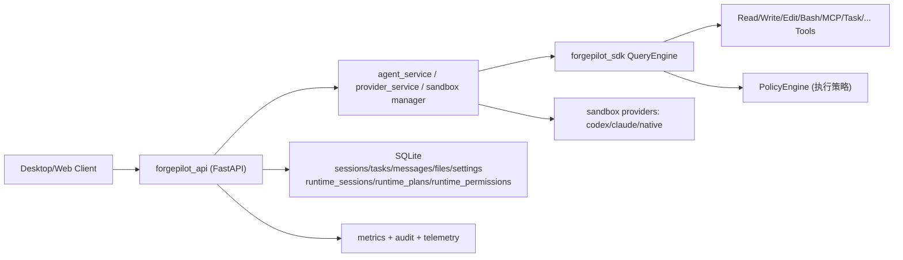

# ForgePilot Agent 项目介绍手册

## 1. 项目是什么

`forgepilot-agent` 是一个面向生产场景的智能体后端运行时，核心目标是把「大模型能力」落成稳定的工程系统，而不是一次性 Demo。

它提供了三层能力：

1. Agent Runtime（`forgepilot_sdk`）
2. API Orchestration（`forgepilot_api`）
3. 统一的工具/沙箱/权限/审计与可观测能力

适合的场景：

- 本地/私有化智能体开发平台
- IDE/桌面端（Tauri/Electron）背后的 Agent 服务层
- 需要可控执行边界、审批流和审计链路的 AI 自动化系统

## 2. 你可以用它做什么

- 计划与执行分离：`/agent/plan -> /agent/execute`
- 单入口执行：`/agent`（直接进入执行流）
- SSE 实时事件流，前端可逐步渲染
- 多 Provider 与模型配置切换
- 文件、Shell、Web、MCP、Skill 等工具编排
- Sandbox 执行（native/codex/claude）
- 权限审批（`/agent/permission`）
- 审计日志与指标输出（`/audit/logs`、`/metrics`）

## 3. 架构总览



## 4. 代码分层说明

### 4.1 `forgepilot_sdk`

职责：模型调用、会话消息编排、工具执行、策略决策。

关键点：

- `QueryEngine`：核心执行循环
- Tool 调用前接入 `PolicyEngine`（`forgepilot_sdk/policy.py`）
- 支持 `allow | deny | require_permission` 决策
- 权限请求事件通过 `permission_request` 机制上抛

### 4.2 `forgepilot_api`

职责：HTTP/SSE 协议层、服务编排、持久化、鉴权与治理。

关键点：

- API 路由：`/agent/*`、`/sandbox/*`、`/providers/*`、`/files/*`、`/mcp/*`
- `agent_service`：计划/执行流程、语义阻断、trace capture
- `sandbox.manager`：provider 选择与 fallback 策略
- `storage`：SQLite 持久化会话、任务、消息、运行时状态

### 4.3 `.refs/forgepilot-shell`

职责：前端/桌面壳参考实现，与后端通过 HTTP + SSE 协议联动。

## 5. 请求生命周期（最重要）

### 5.1 计划-执行双阶段

1. 用户请求 `POST /agent/plan`
2. 服务返回计划（`plan` 事件）
3. 前端确认后调用 `POST /agent/execute`
4. 执行阶段实时推送 `tool_use/tool_result/text/result`

### 5.2 单阶段直执行

1. 用户请求 `POST /agent`
2. 直接进入执行链路
3. 若触发策略审批，收到 `permission_request`
4. 前端调用 `POST /agent/permission` 回传审批结果

### 5.3 SSE 事件类型

基础兼容事件（基线）包括：

- `text`
- `tool_use`
- `tool_result`
- `result`
- `error`
- `session`
- `done`
- `plan`
- `direct_answer`

## 6. 执行隔离与语义 Harness（安全重点）

这是本项目与普通 Agent Demo 的核心差异。

### 6.1 执行策略层（PolicyEngine）

位置：`forgepilot_sdk/policy.py`

行为：

- 文件工具（`Read/Write/Edit/NotebookEdit`）统一做路径规范化与边界校验
- 拦截目录穿越、绝对路径越界、命令路径逃逸
- Bash 命令分级：`low / medium / high`
- 输出统一决策：
  - `allow`
  - `deny`
  - `require_permission`

### 6.2 生产环境默认更严格

- 高风险 Bash 默认拒绝（可配置）
- 中风险 Bash 默认审批（在严格生产策略下）
- Sandbox implicit native fallback 可在生产默认关闭

### 6.3 语义证据链

位置：`forgepilot_api/services/agent_service.py`

能力：

- 建立 `tool_use -> tool_result -> final result` 关联
- 当模型宣称“已写入文件”但无真实成功工具证据时，阻断成功结果
- policy deny 与执行证据不一致时，输出语义阻断 marker

常见 marker：

- `__POLICY_DENIED__`
- `__UNVERIFIED_FILE_OPERATION__`
- `__POLICY_EXECUTION_MISMATCH__`

### 6.4 Trace Capture / Replay

- 可开启策略 trace 记录，定位语义回归
- 支持 replay 事件序列用于复现分析

## 7. 快速开始（10 分钟）

### 7.1 环境准备

```bash
export UV_CACHE_DIR="$PWD/.cache/uv"
export UV_PYTHON_INSTALL_DIR="$PWD/.cache/uv/python"
export UV_PROJECT_ENVIRONMENT="$PWD/.venv"
export PNPM_STORE_DIR="$PWD/.cache/pnpm-store"

uv sync --extra dev
```

### 7.2 启动 API

```bash
uv run python scripts/dev.py api --host 127.0.0.1 --port 2026
```

### 7.3 快速冒烟

```bash
uv run python scripts/dev.py smoke --base-url http://127.0.0.1:2026 --require-plan
```

### 7.4 本地质量校验

```bash
uv run python scripts/dev.py verify
```

## 8. 常用 API 示例

### 8.1 直接执行

```bash
curl -N -X POST http://127.0.0.1:2026/agent \
  -H "Content-Type: application/json" \
  -d '{
    "prompt": "Create a simple index.html in current workspace",
    "language": "zh-CN"
  }'
```

### 8.2 计划后执行

```bash
curl -N -X POST http://127.0.0.1:2026/agent/plan \
  -H "Content-Type: application/json" \
  -d '{"prompt":"帮我创建一个包含导航栏的 landing page"}'
```

拿到 `planId` 后：

```bash
curl -N -X POST http://127.0.0.1:2026/agent/execute \
  -H "Content-Type: application/json" \
  -d '{"planId":"<your-plan-id>","prompt":"执行该计划"}'
```

### 8.3 权限审批回传

```bash
curl -X POST http://127.0.0.1:2026/agent/permission \
  -H "Content-Type: application/json" \
  -d '{
    "sessionId": "<session-id>",
    "permissionId": "<permission-id>",
    "approved": true
  }'
```

## 9. 关键配置（建议先看这组）

### 9.1 基础运行

- `FORGEPILOT_LOG_LEVEL`
- `FORGEPILOT_EXPOSE_METRICS`
- `FORGEPILOT_WORK_DIR`
- `NODE_ENV`

### 9.2 鉴权与治理

- `FORGEPILOT_AUTH_MODE=off|api_key|jwt|api_key_or_jwt`
- `FORGEPILOT_API_KEYS`
- `FORGEPILOT_JWT_SECRET`
- `FORGEPILOT_RBAC_ENABLED`
- `FORGEPILOT_RATE_LIMIT_ENABLED`
- `FORGEPILOT_AUDIT_LOG_ENABLED`

### 9.3 执行策略与隔离

- `FORGEPILOT_POLICY_ENABLED=true`
- `FORGEPILOT_POLICY_STRICT_PROD=true`
- `FORGEPILOT_POLICY_DEV_RELAXED=true`
- `FORGEPILOT_BASH_HIGH_RISK_MODE=deny|require_permission|allow`
- `FORGEPILOT_SANDBOX_ALLOW_NATIVE_FALLBACK=false`（生产建议）
- `FORGEPILOT_POLICY_TRACE_ENABLED=true|false`
- `FORGEPILOT_POLICY_TRACE_DIR=<path>`

## 10. 数据与持久化

默认 SQLite（`~/.forgepilot/forgepilot.db`）包括：

- `sessions`
- `tasks`
- `messages`
- `files`
- `settings`
- `audit_logs`
- `runtime_sessions`
- `runtime_plans`
- `runtime_permissions`

说明：

- `runtime_*` 表用于计划与权限审批等短生命周期状态。
- 如果启用 Redis runtime backend，可用于多实例状态同步。

## 11. 可观测与质量门禁

### 11.1 观测

- 健康检查：`/health`
- 依赖检查：`/health/dependencies`
- 指标：`/metrics`
- 审计日志：`/audit/logs`

### 11.2 Parity 与语义门禁

```bash
uv run python scripts/generate_parity_report.py \
  --repo-root . \
  --output docs/parity_report.md \
  --strict \
  --strict-semantic
```

报告文件：`docs/parity_report.md`

## 12. 新同学建议阅读顺序

1. `README.md`
2. `docs/project_handbook.md`（本文）
3. `docs/engineering_standards.md`
4. `forgepilot_api/app.py`
5. `forgepilot_api/services/agent_service.py`
6. `forgepilot_sdk/engine.py`
7. `forgepilot_sdk/policy.py`

## 13. 常见问题（FAQ）

### Q1：为什么模型说“完成了”，前端却看到错误？

可能触发了语义阻断：模型声明结果与工具证据链不一致，会被改写为错误结果，防止“幻觉式完成”。

### Q2：为什么在生产环境里不能自动回退到 native sandbox？

这是安全默认策略，避免隔离能力失效时无感降级到无隔离执行。需要显式开启 `FORGEPILOT_SANDBOX_ALLOW_NATIVE_FALLBACK=true`。

### Q3：为什么工具执行被拒绝？

通常是：

- 路径越界（超出会话 `cwd`）
- Bash 命令命中中高风险规则
- 需要审批但未批准

### Q4：本项目和“直接调用 OpenAI API”有什么区别？

本项目补齐了工程化缺失层：会话状态、权限审批、沙箱策略、审计、SSE 协议、语义回归门禁、可观测指标和持续验证链路。

---

如果你要把这个项目给外部团队落地，建议先固定一套 `prod` 环境变量模板，并在 staging 连续跑一周 trace + parity strict，再上线。
